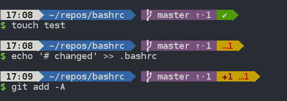

# vNOC-Prep
This is a public repo for the team to test with.  Please do not add sensitive data in here as this is public.  Test until we all get access under the company's umbrella.   Your NOC Manager - TD

This repo is created for the git repo training class.

READ THIS BEFORE STARTING:
If you are not a administrator of this repository please work with a forked (local copy) repository.
To fork this repo please click on the "fork" button on the top right of this screen.
Next, choose to fork this on your personal account.
Once, the repository is forked you will get a exact copy of the current repository page but the location of this copy would be located in "[personal acct]/vNOC-Prep"
Use the link located on the [clone or download] button and use either ssh/https protocol to clone this forked repo using git.
The forked repo will act as your training ground to practice and experiment with various remote git operations

Once you are done, if you wish to delete the repo, please go to the settings button on the top right -> scroll down to danger zone and click "Delete this repository".
This is only possible if you are the admin of the repo. You will have admin access to your forked repo but you will not have admin access to "tan-duong-volusion/vNOC-Prep"

More Training materials:
https://git-scm.com/book/en/v2/
